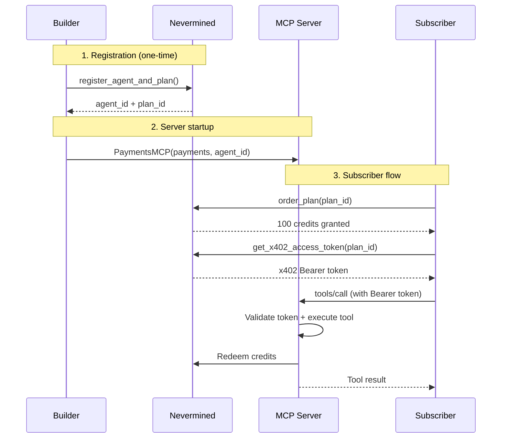

# MCP Server Agent

An MCP server with payment-protected data tools powered by Nevermined's `PaymentsMCP`.

## Overview

This agent demonstrates how to monetize MCP (Model Context Protocol) tools using Nevermined. It exposes three data tools with tiered credit pricing — including dynamic pricing based on output size and depth. OAuth 2.1, token validation, and credit redemption are handled automatically by the `PaymentsMCP` class from `payments-py`.

Any MCP-compatible client (Claude Code, Cursor, custom agents) can discover and call the tools. Subscribers purchase a credit plan, get an x402 access token, and pay per tool call.

## Architecture

```
                    ┌──────────────────────────────────┐
                    │         PaymentsMCP               │
                    │                                   │
                    │  ┌────────────┐  ┌─────────────┐ │
                    │  │search_data │  │summarize_data│ │
                    │  │ (1 credit) │  │ (2-10 cr.)  │ │
                    │  └────────────┘  └─────────────┘ │
                    │         ┌──────────────┐         │
                    │         │research_data │         │
                    │         │  (5-20 cr.)  │         │
                    │         └──────────────┘         │
                    └──────────┬───────────────────────┘
                               │
                    ┌──────────▼──────────────────────┐
                    │  HTTP server (port 3000)         │
                    │  /mcp          MCP protocol      │
                    │  /health       Health check      │
                    │  /.well-known  OAuth 2.1         │
                    │  /register     Client registration│
                    └─────────────────────────────────┘
```

## Quick Start

```bash
poetry install
cp .env.example .env
# Edit .env: set NVM_API_KEY (builder), NVM_SUBSCRIBER_API_KEY, and OPENAI_API_KEY

# 1. Register agent + plan on Nevermined (writes NVM_AGENT_ID and NVM_PLAN_ID to .env)
poetry run python -m src.setup

# 2. Start the server
poetry run python -m src.server

# 3. Run the client (in another terminal)
poetry run python -m src.client
```

## How It Works



## Tool Pricing

| Tool | Credits | Type | Description |
|------|---------|------|-------------|
| `search_data` | 1 | Fixed | Quick web search via DuckDuckGo |
| `summarize_data` | 2-10 | Dynamic | AI-powered content summarization (OpenAI) |
| `research_data` | 5-20 | Dynamic | Multi-step market research (search + fetch + AI synthesis) |

### Dynamic Pricing Details

`summarize_data` and `research_data` calculate cost **after** execution based on the result:

**`summarize_data`** — base 2 credits + 1 per 500 chars of output (cap: 10)

| Output length | Credits |
|---------------|---------|
| < 500 chars | 2 |
| ~1000 chars | 4 |
| ~2500 chars | 7 |
| 4000+ chars | 10 |

**`research_data`** — base depends on depth, + 1 per 500 chars of output (cap: 20)

| Depth | Short output | Medium (~2500) | Long (5000+) |
|-------|-------------|----------------|--------------|
| `standard` | 5 | 10 | 20 |
| `deep` | 10 | 15 | 20 |

## Configuration

### Environment Variables

| Variable | Used by | Description |
|----------|---------|-------------|
| `NVM_API_KEY` | setup, server | Builder API key ([nevermined.app](https://nevermined.app) > API Keys) |
| `NVM_SUBSCRIBER_API_KEY` | client | Subscriber API key (a different Nevermined account) |
| `NVM_ENVIRONMENT` | all | `staging` (default), `staging_sandbox`, `live`, or `sandbox` |
| `NVM_AGENT_ID` | server | Auto-created by `src.setup` |
| `NVM_PLAN_ID` | server, client | Auto-created by `src.setup` |
| `OPENAI_API_KEY` | server | For summarize and research tools |
| `PORT` | server | Server port (default: 3000) |

### Connecting from Claude Code

```json
{
  "mcpServers": {
    "data-tools": {
      "url": "http://localhost:3000/mcp"
    }
  }
}
```

## PaymentsMCP & Decorators

The `PaymentsMCP` class wraps a standard MCP server and adds the Nevermined paywall. It provides three decorators matching the MCP primitive types: **tools**, **resources**, and **prompts**.

### `@mcp.tool`

Registers a function as a payment-protected MCP tool.

```python
from payments_py.mcp import PaymentsMCP

mcp = PaymentsMCP(payments, name="my-server", agent_id=AGENT_ID)

@mcp.tool(credits=1)
def search_data(query: str) -> str:
    """Search the web for data."""
    return do_search(query)
```

| Parameter | Type | Default | Description |
|-----------|------|---------|-------------|
| `name` | `str` | function name | Tool name exposed via MCP |
| `description` | `str` | docstring | Tool description for discovery |
| `credits` | `int \| Callable` | `None` | Credits to charge per call |
| `on_redeem_error` | `str` | `"ignore"` | `"ignore"` or `"propagate"` |

The decorator extracts input schema from type hints automatically. It handles both sync and async functions, and converts the return value to MCP format.

### Dynamic credits with a callable

Pass a function instead of an integer. It receives a context dict **after** execution:

```python
def calculate_credits(ctx: Dict[str, Any]) -> int:
    result = ctx.get("result") or {}
    content = result.get("content", [])
    text = content[0].get("text", "") if content else ""
    return min(10, max(2, 2 + len(text) // 500))

@mcp.tool(credits=calculate_credits)
def summarize_data(content: str) -> str:
    """Summarize content using AI."""
    return call_llm(content)
```

The context dict:

```python
{
    "args": {"content": "...", "focus": "key_findings"},        # Tool input
    "result": {"content": [{"type": "text", "text": "..."}]},  # Tool output (MCP format)
    "request": { ... }                                          # HTTP request metadata
}
```

### `@mcp.resource` and `@mcp.prompt`

Same pattern for the other MCP primitives:

```python
@mcp.resource("data://reports/{id}", name="report", credits=2)
def get_report(id: str) -> str:
    return fetch_report(id)

@mcp.prompt("analyze", credits=3)
def analyze_prompt(topic: str) -> str:
    return f"Analyze the following topic: {topic}"
```

### MCP Logical URIs

When registering an agent, tools use logical URIs instead of HTTP URLs. This decouples the registration from the physical server — the same registration works on localhost or production.

```python
Endpoint(verb="POST", url="mcp://my-server/tools/search_data")
```

Format: `mcp://<server-name>/<type>/<method-name>` — the `<server-name>` must match `PaymentsMCP(name=...)`.

## Project Structure

```
src/
  server.py       # PaymentsMCP server with @mcp.tool decorators
  client.py       # Subscriber client (order plan + call tools)
  setup.py        # One-time agent + plan registration on Nevermined
  tools/
    web_search.py       # DuckDuckGo search (search_data)
    summarize.py        # OpenAI summarization (summarize_data)
    market_research.py  # Multi-step research pipeline (research_data)
```

## Customization Ideas

1. **Swap data sources** — Replace DuckDuckGo with Exa, Tavily, or your own APIs
2. **Add new tools** — Any function with a `@mcp.tool(credits=N)` decorator becomes a paid MCP tool
3. **Monetize resources and prompts** — Use `@mcp.resource` and `@mcp.prompt` to charge for static data or prompt templates
4. **Custom pricing strategies** — Price by token count, API cost, response time, user tier, or any other metric
5. **Paid MCP for IDEs** — Expose proprietary code analysis, linting, or refactoring tools as paid MCP services in Claude Code or Cursor
6. **Multi-plan tiers** — Create separate plans with different credit grants for free/pro/enterprise users
