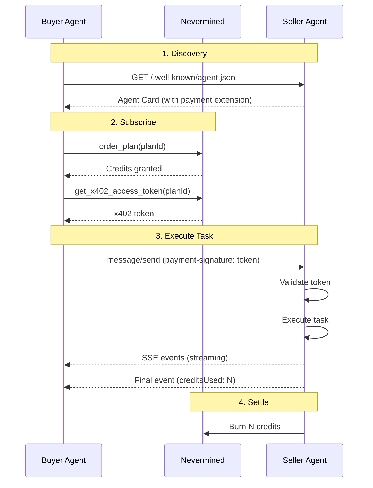

# Nevermined Talks -- Technical Deep Dives

Three talk tracks covering how to monetize AI agents and services using Nevermined's payment infrastructure.

---

# Talk 1: Nevermined & Payments Library Setup

## What Is Nevermined?

Nevermined is a payment infrastructure for AI agents. It lets builders monetize APIs, tools, and agent services with credit-based billing, automatic settlement, and subscriber management. It works across three protocols:

- **x402** -- HTTP-based payment protocol (402 Payment Required)
- **A2A** -- Google's Agent-to-Agent protocol with payment extensions
- **MCP** -- Model Context Protocol for tool/resource monetization

All three share the same foundation: **payment plans**, **credit redemption**, and **x402 access tokens**.

## Core Concepts

### The Three Roles

| Role | What they do | API key type |
|------|-------------|-------------|
| **Builder** | Registers agents, creates plans, runs servers | Builder API key |
| **Subscriber** | Purchases plans, gets tokens, consumes services | Subscriber API key |
| **Facilitator** | Verifies tokens, settles credits (Nevermined infra) | Automatic |

### The Three Steps

1. **Register** -- Define what you're charging for (an endpoint, a tool, an agent) and create a payment plan
2. **Protect** -- Add a paywall to your service (middleware, decorator, or wrapper)
3. **Settle** -- Verify tokens and burn credits after successful execution

### Payment Plans

Plans define how subscribers pay for access:

| Plan type | How it works | Example |
|-----------|-------------|---------|
| **Credits (fixed)** | Same cost per request | 100 credits, 1 per request |
| **Credits (dynamic)** | Variable cost per request | 100 credits, 1-10 per request |
| **Time-based** | Access expires after duration | 30 days unlimited access |
| **Pay-as-you-go** | No upfront purchase | Charged per use |
| **Free/Trial** | No cost, limited credits | 10 free credits |

### Payment Schemes

| Scheme | When | How |
|--------|------|-----|
| `nvm:erc4337` | Crypto plans | Smart account settlement on Base (~$0.0001/tx) |
| `nvm:card-delegation` | Fiat plans | Stripe credit card delegation |

The SDK auto-detects the scheme from plan metadata.

## Getting Started -- Python

### Installation

```bash
pip install payments-py
# or with poetry
poetry add payments-py
```

For MCP support:

```bash
pip install "payments-py[mcp]"
```

### Initialization

```python
from payments_py import Payments, PaymentOptions

payments = Payments.get_instance(
    PaymentOptions(
        nvm_api_key=os.environ["NVM_API_KEY"],
        environment="sandbox"  # or "live", "staging_sandbox"
    )
)
```

### Available Sub-modules

| Module | Purpose |
|--------|---------|
| `payments.plans` | Create and manage payment plans |
| `payments.agents` | Register agents |
| `payments.x402` | Generate x402 access tokens |
| `payments.facilitator` | Verify and settle permissions |
| `payments.mcp` | MCP server integration |
| `payments.a2a` | A2A protocol integration |
| `payments.observability` | LLM cost tracking |

### API Key Format

| Environment | Key prefix | Backend |
|-------------|-----------|---------|
| Sandbox | `sandbox:` | `api.sandbox.nevermined.app` |
| Live | `live:` | `api.live.nevermined.app` |
| Staging Sandbox | `sandbox-staging:` | `api.sandbox.nevermined.dev` |
| Staging Live | `live-staging:` | `api.live.nevermined.dev` |

Get your API key at [nevermined.app](https://nevermined.app) > API Keys > Global NVM API Keys.

## Getting Started -- TypeScript

### Installation

```bash
npm install @nevermined-io/payments zod dotenv
npm install -D typescript @types/node ts-node
```

### Initialization

```typescript
import { Payments, EnvironmentName } from "@nevermined-io/payments";

const payments = Payments.getInstance({
  nvmApiKey: process.env.NVM_API_KEY!,
  environment: (process.env.NVM_ENVIRONMENT as EnvironmentName) || "sandbox",
});
```

## Creating Payment Plans

### No-Code (Nevermined App)

1. Go to [nevermined.app](https://nevermined.app) > My Agents > Register New Agent
2. Enter metadata: name, description, tags
3. Configure API endpoints (HTTP method + URL)
4. Create a payment plan (credit-based, time-based, or trial)
5. Copy the `planId` and `agentId`

### Programmatic -- Python

```python
from payments_py import Payments, PaymentOptions
from payments_py.common.types import (
    AgentMetadata, AgentAPIAttributes, Endpoint, PlanMetadata,
)
from payments_py.plans import get_free_price_config, get_dynamic_credits_config

payments = Payments.get_instance(
    PaymentOptions(nvm_api_key=NVM_API_KEY, environment="sandbox")
)

# Agent metadata
agent_metadata = AgentMetadata(
    name="My AI Agent",
    description="An AI agent with payment-protected tools",
    tags=["ai", "data", "search"],
)

# API endpoints
agent_api = AgentAPIAttributes(
    endpoints=[
        Endpoint(verb="POST", url="https://my-agent.com/ask"),
    ],
)

# Plan: free, 100 dynamic credits
plan_metadata = PlanMetadata(
    name="Starter Plan",
    description="100 credits for AI agent access",
)

price_config = get_free_price_config()

credits_config = get_dynamic_credits_config(
    credits_granted=100,
    min_credits_per_request=1,
    max_credits_per_request=10,
)

# Register both at once
result = payments.agents.register_agent_and_plan(
    agent_metadata=agent_metadata,
    agent_api=agent_api,
    plan_metadata=plan_metadata,
    price_config=price_config,
    credits_config=credits_config,
    access_limit="credits",
)

print(f"Agent ID: {result['agentId']}")
print(f"Plan ID:  {result['planId']}")
```

### Programmatic -- TypeScript

```typescript
import { Payments, getERC20PriceConfig, getFixedCreditsConfig } from "@nevermined-io/payments";

const payments = Payments.getInstance({
  nvmApiKey: process.env.NVM_API_KEY!,
  environment: "sandbox",
});

// Price: 10 USDC for 100 credits
const priceConfig = getERC20PriceConfig(
  10_000_000n,  // 10 USDC (6 decimals)
  "0xA0b86991c6218b36c1d19D4a2e9Eb0cE3606eB48",  // USDC address
  process.env.BUILDER_ADDRESS!,
);

const creditsConfig = getFixedCreditsConfig(100n, 1n);

const { planId } = await payments.plans.createPlan({
  agentId: "did:nv:agent-123",
  name: "Pro Plan - 100 Queries",
  description: "Access to AI assistant with 100 queries",
  priceConfig,
  creditsConfig,
  accessLimit: "credits",
});
```

### Credits Configuration Types

```python
# Fixed: every request costs exactly N credits
from payments_py.plans import get_fixed_credits_config
credits = get_fixed_credits_config(credits_granted=100, credits_per_request=1)

# Dynamic: cost varies between min and max
from payments_py.plans import get_dynamic_credits_config
credits = get_dynamic_credits_config(
    credits_granted=100,
    min_credits_per_request=1,
    max_credits_per_request=10,
)

# Pay-as-you-go: no upfront credits
from payments_py.plans import get_pay_as_you_go_credits_config
credits = get_pay_as_you_go_credits_config()
```

## The x402 Protocol Flow

The foundation that all three protocols (HTTP, A2A, MCP) build on:

```
Client                          Server                    Nevermined
  │                               │                          │
  │  1. POST /ask (no token)      │                          │
  │──────────────────────────────>│                          │
  │                               │                          │
  │  2. 402 Payment Required      │                          │
  │     Header: payment-required  │                          │
  │<──────────────────────────────│                          │
  │                               │                          │
  │  3. Decode payment-required   │                          │
  │     Extract planId, agentId   │                          │
  │                               │                          │
  │  4. get_x402_access_token(planId)                        │
  │─────────────────────────────────────────────────────────>│
  │                                                          │
  │  5. accessToken                                          │
  │<─────────────────────────────────────────────────────────│
  │                               │                          │
  │  6. POST /ask                 │                          │
  │     Header: payment-signature │                          │
  │──────────────────────────────>│                          │
  │                               │                          │
  │                               │  7. verify_permissions() │
  │                               │─────────────────────────>│
  │                               │                          │
  │                               │  8. Valid                │
  │                               │<─────────────────────────│
  │                               │                          │
  │                               │  (execute handler)       │
  │                               │                          │
  │                               │  9. settle_permissions() │
  │                               │─────────────────────────>│
  │                               │                          │
  │  10. 200 OK + result          │                          │
  │      Header: payment-response │                          │
  │<──────────────────────────────│                          │
```

### x402 HTTP Headers

| Header | Direction | Content |
|--------|-----------|---------|
| `payment-signature` | Client → Server | x402 access token |
| `payment-required` | Server → Client (402) | Base64-encoded JSON with plan details |
| `payment-response` | Server → Client (200) | Base64-encoded settlement receipt |

### PaymentRequired Object

```json
{
  "x402Version": 2,
  "error": "Payment required to access resource",
  "resource": { "url": "/ask" },
  "accepts": [{
    "scheme": "nvm:erc4337",
    "network": "eip155:84532",
    "planId": "did:nv:plan-123",
    "extra": {
      "version": "1",
      "agentId": "did:nv:agent-456"
    }
  }]
}
```

## Protecting HTTP Endpoints

### Python -- FastAPI Middleware (Simplest)

One line of middleware protects all routes:

```python
from payments_py import Payments, PaymentOptions
from payments_py.x402.fastapi import PaymentMiddleware

payments = Payments.get_instance(
    PaymentOptions(nvm_api_key=NVM_API_KEY, environment="sandbox")
)

app = FastAPI()

# One line — protects POST /ask with 1 credit
app.add_middleware(
    PaymentMiddleware,
    payments=payments,
    routes={"POST /ask": {"plan_id": PLAN_ID, "credits": 1}},
)

@app.post("/ask")
async def ask(request: Request):
    # This only runs if payment is valid
    body = await request.json()
    result = call_llm(body["query"])
    return {"response": result}
```

### Python -- Strands Decorator

For Strands SDK agents, use the `@requires_payment` decorator:

```python
from strands import Agent, tool
from payments_py.x402.strands import requires_payment

@tool(context=True)
@requires_payment(
    payments=payments,
    plan_id=PLAN_ID,
    credits=1,
    agent_id=AGENT_ID,
)
def search_data(query: str, tool_context=None) -> dict:
    """Search for data (1 credit)."""
    return {"status": "success", "content": [{"text": f"Results for: {query}"}]}

agent = Agent(tools=[search_data])
```

The decorator:
1. Returns PaymentRequired error if no token is provided
2. Verifies the token via the Nevermined facilitator
3. Executes the tool on success
4. Burns credits after execution

### TypeScript -- Express Middleware

```typescript
import { paymentMiddleware } from "@nevermined-io/payments/express";

app.use(paymentMiddleware(payments, {
  "POST /ask": { planId: PLAN_ID, credits: 1 },
}));

app.post("/ask", async (req, res) => {
  // Only runs if payment is valid
  const result = await callLLM(req.body.query);
  res.json({ response: result });
});
```

### Dynamic Credits in Middleware

Price based on request content or response size:

```python
# Python -- async function
async def calculate_credits(request: Request) -> int:
    body = await request.json()
    max_tokens = body.get("max_tokens", 100)
    return max(1, max_tokens // 100)

app.add_middleware(
    PaymentMiddleware,
    payments=payments,
    routes={"POST /generate": {"plan_id": PLAN_ID, "credits": calculate_credits}},
)
```

```python
# Python -- sync lambda
app.add_middleware(
    PaymentMiddleware,
    payments=payments,
    routes={
        "POST /analyze": {
            "plan_id": PLAN_ID,
            "credits": lambda req: 5 if req.headers.get("priority") == "high" else 1,
        }
    },
)
```

```typescript
// TypeScript
app.use(paymentMiddleware(payments, {
  "POST /generate": {
    planId: PLAN_ID,
    credits: (req, res) => {
      const tokens = res.locals.tokenCount || 100;
      return Math.ceil(tokens / 100);
    },
  },
}));
```

## Client Side -- Subscribing and Paying

### Python Client

```python
from payments_py import Payments, PaymentOptions

payments = Payments.get_instance(
    PaymentOptions(nvm_api_key=SUBSCRIBER_API_KEY, environment="sandbox")
)

# 1. Subscribe to the plan (once)
balance = payments.plans.get_plan_balance(PLAN_ID)
if not balance.is_subscriber:
    payments.plans.order_plan(PLAN_ID)

# 2. Get x402 access token (per session)
token_result = payments.x402.get_x402_access_token(PLAN_ID)
access_token = token_result["accessToken"]

# 3. Call the protected endpoint
import requests
response = requests.post(
    "http://localhost:3000/ask",
    headers={
        "Content-Type": "application/json",
        "payment-signature": access_token,
    },
    json={"query": "What is AI?"},
)

if response.status_code == 200:
    print(response.json())
elif response.status_code == 402:
    # Decode payment requirements if needed
    import base64, json
    payment_required = json.loads(
        base64.b64decode(response.headers["payment-required"]).decode()
    )
    print(f"Need plan: {payment_required['accepts'][0]['planId']}")
```

### TypeScript Client

```typescript
import { Payments } from "@nevermined-io/payments";

const payments = Payments.getInstance({
  nvmApiKey: process.env.SUBSCRIBER_API_KEY!,
  environment: "sandbox",
});

// 1. Order plan
await payments.plans.orderPlan(PLAN_ID);

// 2. Get token
const { accessToken } = await payments.x402.getX402AccessToken(PLAN_ID);

// 3. Call endpoint
const response = await fetch("http://localhost:3000/ask", {
  method: "POST",
  headers: {
    "Content-Type": "application/json",
    "payment-signature": accessToken,
  },
  body: JSON.stringify({ query: "What is AI?" }),
});
```

## Complete Working Example

Here's a full Python server + client from the tutorials:

### Server (FastAPI + PaymentMiddleware)

```python
"""Protected HTTP Agent with x402 payment middleware."""
import os, sys
from dotenv import load_dotenv
load_dotenv()

import uvicorn
from fastapi import FastAPI, Request
from fastapi.responses import JSONResponse
from openai import OpenAI
from pydantic import BaseModel
from payments_py import Payments, PaymentOptions
from payments_py.x402.fastapi import PaymentMiddleware

OPENAI_API_KEY = os.getenv("OPENAI_API_KEY", "")
NVM_API_KEY = os.getenv("NVM_API_KEY", "")
NVM_PLAN_ID = os.getenv("NVM_PLAN_ID", "")

openai_client = OpenAI(api_key=OPENAI_API_KEY)
payments = Payments.get_instance(
    PaymentOptions(nvm_api_key=NVM_API_KEY, environment=os.getenv("NVM_ENVIRONMENT", "sandbox"))
)

app = FastAPI(title="HTTP Simple Agent")

# Payment protection — one line
app.add_middleware(
    PaymentMiddleware,
    payments=payments,
    routes={"POST /ask": {"plan_id": NVM_PLAN_ID, "credits": 1}},
)

class AskRequest(BaseModel):
    query: str

@app.post("/ask")
async def ask(body: AskRequest):
    response = openai_client.chat.completions.create(
        model="gpt-4o-mini",
        messages=[
            {"role": "system", "content": "You are a helpful assistant."},
            {"role": "user", "content": body.query},
        ],
    )
    return {"response": response.choices[0].message.content}

@app.get("/health")
async def health():
    return {"status": "ok"}

if __name__ == "__main__":
    uvicorn.run(app, host="0.0.0.0", port=int(os.getenv("PORT", "3000")))
```

### Client

```python
"""Client that discovers payment requirements and pays automatically."""
import os, base64, json, requests
from dotenv import load_dotenv
load_dotenv()

from payments_py import Payments, PaymentOptions

SERVER_URL = os.getenv("SERVER_URL", "http://localhost:3000")
payments = Payments.get_instance(
    PaymentOptions(
        nvm_api_key=os.getenv("NVM_API_KEY", ""),
        environment=os.getenv("NVM_ENVIRONMENT", "sandbox"),
    )
)

def ask_agent(query: str) -> str:
    # Step 1: Try without token
    response = requests.post(
        f"{SERVER_URL}/ask",
        json={"query": query},
        headers={"Content-Type": "application/json"},
    )

    if response.status_code == 402:
        # Step 2: Extract payment requirements
        payment_required = json.loads(
            base64.b64decode(response.headers["payment-required"]).decode()
        )
        plan_id = payment_required["accepts"][0]["planId"]
        agent_id = payment_required["accepts"][0].get("extra", {}).get("agentId")

        # Step 3: Get x402 token
        token_res = payments.x402.get_x402_access_token(plan_id, agent_id)
        access_token = token_res["accessToken"]

        # Step 4: Retry with token
        response = requests.post(
            f"{SERVER_URL}/ask",
            json={"query": query},
            headers={
                "Content-Type": "application/json",
                "payment-signature": access_token,
            },
        )

    if response.status_code == 200:
        return response.json()["response"]
    else:
        return f"Error: {response.status_code}"

if __name__ == "__main__":
    print(ask_agent("What are the latest AI trends?"))
```

## Observability & Cost Tracking

Nevermined can track LLM API costs transparently by proxying OpenAI calls through Helicone.

### Production: Per-request observability via `paywall_context`

In MCP and A2A servers, the paywall automatically provides a `paywall_context` containing the real `agent_request` from `verify_permissions`. This links every LLM inference to the actual subscriber, plan, and request:

```python
from payments_py.common.types import StartAgentRequest

@mcp.tool(credits=5)
def summarize_data(content: str, paywall_context=None) -> str:
    """Summarize content using AI."""
    # Extract the real agent_request from the paywall context
    agent_req_data = (paywall_context or {}).get("agent_request")
    if agent_req_data:
        start_req = StartAgentRequest(**agent_req_data)
        oai_config = payments.observability.with_openai(
            api_key=OPENAI_API_KEY,
            start_agent_request=start_req,
            custom_properties={"server": "my-server"},
        )
        # Calls are proxied through Helicone with subscriber metadata
        client = OpenAI(
            api_key=oai_config.api_key,
            base_url=oai_config.base_url,
            default_headers=oai_config.default_headers,
        )
    else:
        client = OpenAI(api_key=OPENAI_API_KEY)

    response = client.chat.completions.create(
        model="gpt-4o-mini",
        messages=[{"role": "user", "content": content}],
    )
    return response.choices[0].message.content
```

The `paywall_context` dict contains:
- `agent_request` -- Full request metadata (subscriber address, plan, balance, request ID)
- `agent_request_id` -- Unique ID for this request (also passed to `settle_permissions`)
- `plan_id`, `subscriber_address`, `credits`, `auth_result`

### Development: Simulation mode

For pricing estimation before setting up a real plan:

```python
agent_request = payments.requests.start_simulation_request()

openai_config = payments.observability.with_openai(
    OPENAI_API_KEY, agent_request, {}
)
client = OpenAI(**openai_config)

response = client.chat.completions.create(
    model="gpt-4o-mini",
    messages=[{"role": "user", "content": "Hello"}],
)

payments.requests.finish_simulation_request(agent_request.agent_request_id)
```

---

# Talk 2: Nevermined & A2A (Agent-to-Agent Protocol)

## What Is A2A?

A2A is Google's Agent-to-Agent protocol that enables heterogeneous multi-agent systems to communicate using JSON-RPC. Agents can discover each other, exchange messages, and execute tasks asynchronously.

Nevermined integrates with A2A to add **payment authorization and credit settlement** to agent-to-agent interactions.

## How A2A + Nevermined Works

### The A2A Stack

```
┌──────────────────────────────────────┐
│  A2A Protocol (Google)               │
│  - Agent Cards for discovery         │
│  - JSON-RPC for messaging            │
│  - SSE for streaming                 │
│  - Task lifecycle management         │
├──────────────────────────────────────┤
│  Nevermined Payment Layer            │
│  - Payment extension in Agent Card   │
│  - x402 token in payment-signature   │
│  - Credit settlement on completion   │
│  - PaymentsClient for auto-payment   │
├──────────────────────────────────────┤
│  Transport (HTTP)                    │
└──────────────────────────────────────┘
```

### Key Concepts

| Concept | Description |
|---------|-------------|
| **Agent Card** | JSON at `/.well-known/agent.json` describing capabilities + payment info |
| **Payment Extension** | `urn:nevermined:payment` extension in agent card with plan/pricing details |
| **PaymentsRequestHandler** | Server-side handler that validates x402 tokens on incoming A2A messages |
| **PaymentsClient** | Client-side wrapper that auto-injects x402 tokens into outgoing A2A messages |
| **Task Events** | SSE events including `creditsUsed` in final status metadata |

### The Flow



## Agent Card with Payment Extension

The agent card is served at `/.well-known/agent.json`. Nevermined adds a payment extension:

```json
{
  "name": "Data Selling Agent",
  "url": "http://localhost:9000",
  "version": "1.0.0",
  "capabilities": {
    "streaming": true,
    "extensions": [
      {
        "uri": "urn:nevermined:payment",
        "params": {
          "paymentType": "dynamic",
          "planId": "did:nv:plan-123",
          "agentId": "did:nv:agent-456",
          "credits": 1,
          "costDescription": "Credits vary by tool: search=1, summarize=5, research=10"
        }
      }
    ]
  },
  "skills": [
    {
      "name": "search_data",
      "description": "Search for data (1 credit)"
    },
    {
      "name": "research_data",
      "description": "Deep research with citations (10 credits)"
    }
  ]
}
```

### Building the Agent Card (Python)

```python
from payments_py.a2a import build_payment_agent_card

agent_card = build_payment_agent_card(
    base_card={
        "name": "Data Selling Agent",
        "url": "http://localhost:9000",
        "version": "1.0.0",
        "capabilities": {"streaming": True},
        "skills": [
            {"name": "search_data", "description": "Search for data (1 credit)"},
            {"name": "research_data", "description": "Deep research (10 credits)"},
        ],
    },
    payment_metadata={
        "paymentType": "dynamic",
        "credits": 1,
        "planId": NVM_PLAN_ID,
        "agentId": NVM_AGENT_ID,
        "costDescription": "Credits vary by tool: search=1, research=10",
    },
)
```

## Building an A2A Seller Agent

### Architecture

An A2A seller agent has three components:

1. **Agent Card** -- served at `/.well-known/agent.json` with payment metadata
2. **Executor** -- handles incoming tasks, runs tools, emits events
3. **A2A Server** -- receives JSON-RPC messages, validates payments, routes to executor

### The Executor Pattern

The executor processes tasks and emits `creditsUsed` in the final event:

```python
from a2a.server.agent_execution import AgentExecutor
from a2a.server.events import EventQueue

class SellerExecutor(AgentExecutor):
    def __init__(self, agent, credit_map: dict[str, int]):
        self._agent = agent
        self._credit_map = credit_map  # {"search_data": 1, "summarize_data": 5}

    async def execute(self, context, event_queue: EventQueue):
        # Extract user text from A2A message
        user_text = self._extract_user_text(context)

        # Run agent (Strands, LangChain, or custom)
        result = await asyncio.to_thread(self._agent, user_text)

        # Calculate credits from tool usage
        credits_used = self._calculate_credits(self._agent.messages)

        # Emit final event with creditsUsed metadata
        await event_queue.enqueue_event(
            TaskStatusUpdateEvent(
                task_id=task_id,
                context_id=context_id,
                status=TaskStatus(
                    state=TaskState.completed,
                    message=Message(
                        role="agent",
                        parts=[TextPart(text=response_text)],
                    ),
                ),
                final=True,
                metadata={"creditsUsed": credits_used},  # Triggers settlement
            )
        )

    def _calculate_credits(self, messages) -> int:
        """Sum credits from tool_use blocks in agent messages."""
        total = 0
        for msg in messages:
            if hasattr(msg, "content"):
                for block in msg.content:
                    if hasattr(block, "name") and block.name in self._credit_map:
                        total += self._credit_map[block.name]
        return total if total > 0 else min(self._credit_map.values())
```

### Important: Plain Tools for A2A

In A2A mode, tools do NOT use the `@requires_payment` decorator. Payment validation happens at the **message level** (via `PaymentsRequestHandler`), not at the tool level:

```python
from strands import tool

# Plain tool — no payment decorator
@tool
def search_data(query: str, max_results: int = 5) -> dict:
    """Search for data."""
    return search_web(query, max_results)

@tool
def research_data(query: str, depth: str = "standard") -> dict:
    """Deep research with citations."""
    return research_market(query, depth)
```

### Starting the A2A Server

```python
from a2a.server.apps import A2AFastAPIApplication
from a2a.server.request_handlers import DefaultRequestHandler
from payments_py.a2a import PaymentsRequestHandler

# Executor with credit map
executor = SellerExecutor(agent, credit_map={"search_data": 1, "research_data": 10})

# PaymentsRequestHandler wraps the executor with payment validation
handler = PaymentsRequestHandler(
    payments=payments,
    agent_card=agent_card,
    default_credits=1,
    executor=executor,
)

# A2A server
a2a_app = A2AFastAPIApplication(
    agent_card=agent_card,
    http_handler=handler,
)

# Mount on FastAPI
import uvicorn
app = a2a_app.build()
uvicorn.run(app, host="0.0.0.0", port=9000)
```

## Building an A2A Buyer Agent

### Discovery Flow

The buyer agent discovers sellers via their agent cards:

```python
import httpx

def discover_agent(agent_url: str) -> dict:
    """Fetch and parse agent card from /.well-known/agent.json."""
    card_url = f"{agent_url.rstrip('/')}/.well-known/agent.json"

    with httpx.Client(timeout=15.0) as client:
        response = client.get(card_url)

    card = response.json()

    # Extract payment extension
    payment_info = None
    extensions = card.get("capabilities", {}).get("extensions", [])
    for ext in extensions:
        if ext.get("uri") == "urn:nevermined:payment":
            payment_info = ext.get("params", {})

    return {
        "name": card.get("name"),
        "skills": card.get("skills", []),
        "payment": payment_info,  # {planId, agentId, credits, costDescription}
    }
```

### Purchasing via PaymentsClient

The `PaymentsClient` auto-injects x402 tokens into A2A messages:

```python
from payments_py.a2a import PaymentsClient
from a2a.types import Message, MessageSendParams, TextPart
from uuid import uuid4

def purchase_from_seller(
    payments: Payments,
    plan_id: str,
    agent_url: str,
    agent_id: str,
    query: str,
) -> dict:
    """Send A2A message with automatic x402 payment."""

    # PaymentsClient handles token injection automatically
    client = PaymentsClient(
        agent_base_url=agent_url,
        payments=payments,
        agent_id=agent_id,
        plan_id=plan_id,
    )

    params = MessageSendParams(
        message=Message(
            message_id=str(uuid4()),
            role="user",
            parts=[TextPart(text=query)],
        )
    )

    # Stream response (SSE events)
    events = asyncio.run(_collect_stream(client, params))
    return _extract_result(events)


async def _collect_stream(client, params):
    events = []
    async for event in client.send_message_stream(params):
        events.append(event)
    return events


def _extract_result(events) -> dict:
    """Extract final response and creditsUsed from events."""
    for event in reversed(events):
        task = event[0]
        status_update = event[1] if len(event) > 1 else None

        if task.status.state == "completed":
            message = task.status.message
            text = "".join(
                p.text for p in message.parts if hasattr(p, "text")
            )
            credits = (
                status_update.metadata.get("creditsUsed", 0)
                if status_update and status_update.metadata
                else 0
            )
            return {"response": text, "credits_used": credits}

    return {"response": "No response", "credits_used": 0}
```

### Seller Registry

A buyer typically maintains a registry of known sellers:

```python
from dataclasses import dataclass, field
import threading

@dataclass
class SellerInfo:
    url: str
    name: str
    description: str
    skills: list[dict]
    plan_id: str = ""
    agent_id: str = ""
    credits: int = 1

class SellerRegistry:
    def __init__(self):
        self._sellers: dict[str, SellerInfo] = {}
        self._lock = threading.Lock()

    def register(self, agent_url: str, agent_card: dict) -> SellerInfo:
        """Parse agent card and register seller."""
        extensions = agent_card.get("capabilities", {}).get("extensions", [])
        plan_id = agent_id = ""
        credits = 1

        for ext in extensions:
            if ext.get("uri") == "urn:nevermined:payment":
                params = ext.get("params", {})
                plan_id = params.get("planId", "")
                agent_id = params.get("agentId", "")
                credits = params.get("credits", 1)

        info = SellerInfo(
            url=agent_url,
            name=agent_card.get("name", ""),
            description=agent_card.get("description", ""),
            skills=agent_card.get("skills", []),
            plan_id=plan_id,
            agent_id=agent_id,
            credits=credits,
        )

        with self._lock:
            self._sellers[agent_url] = info
        return info

    def get_payment_info(self, url: str) -> dict:
        with self._lock:
            info = self._sellers.get(url)
        if not info:
            return {}
        return {"planId": info.plan_id, "agentId": info.agent_id, "credits": info.credits}
```

### Budget Management

Buyers can enforce spending limits:

```python
class Budget:
    def __init__(self, max_daily: int = 0, max_per_request: int = 0):
        self._max_daily = max_daily
        self._max_per_request = max_per_request
        self._daily_spend = 0

    def can_spend(self, credits: int) -> tuple[bool, str]:
        if self._max_per_request > 0 and credits > self._max_per_request:
            return False, f"Exceeds per-request limit ({self._max_per_request})"
        if self._max_daily > 0 and (self._daily_spend + credits) > self._max_daily:
            return False, f"Exceeds daily limit ({self._max_daily - self._daily_spend} remaining)"
        return True, "OK"

    def record_purchase(self, credits: int):
        self._daily_spend += credits
```

## A2A vs HTTP Mode Comparison

| Aspect | HTTP Mode (x402) | A2A Mode |
|--------|------------------|----------|
| Discovery | `GET /pricing` (custom) | `/.well-known/agent.json` (standard) |
| Communication | REST endpoints | JSON-RPC messages |
| Payment validation | `@requires_payment` per tool | `PaymentsRequestHandler` per message |
| Token transport | `payment-signature` header | `payment-signature` header |
| Streaming | No (request/response) | Yes (SSE events) |
| Credit settlement | Per tool call | Per task completion (`creditsUsed` metadata) |
| Interoperability | Custom protocol | Any A2A-compatible agent |
| Tool decorators | `@requires_payment` needed | Plain `@tool` (no decorator) |

## Self-Registration Pattern

Sellers can register themselves with a buyer's registration server:

```python
def register_with_buyer(buyer_url: str, self_url: str):
    """Seller sends its URL to buyer's registration endpoint."""
    payload = {
        "jsonrpc": "2.0",
        "id": 1,
        "method": "message/send",
        "params": {
            "message": {
                "role": "user",
                "parts": [{"kind": "text", "text": self_url}],
            }
        },
    }
    requests.post(buyer_url, json=payload, headers={"Content-Type": "application/json"})
```

The buyer's registration server fetches the agent card from the seller URL and adds it to the registry.

## TypeScript A2A Example

### Server (Agent)

```typescript
import { Payments } from "@nevermined-io/payments";

const payments = Payments.getInstance({
  nvmApiKey: process.env.NVM_API_KEY!,
  environment: "sandbox",
});

class MyExecutor implements AgentExecutor {
  async execute(context, eventBus) {
    const userText = extractText(context);
    const result = await processRequest(userText);
    const creditsUsed = calculateCredits(result);

    eventBus.publish({
      kind: "status-update",
      taskId: context.task?.id,
      status: { state: "completed", message: { role: "agent", parts: [{ text: result }] } },
      final: true,
      metadata: { creditsUsed },  // Variable credits
    });
    eventBus.finished();
  }
}

const serverResult = await payments.a2a.start({
  port: 3005,
  basePath: "/a2a/",
  agentCard: agentCard,
  executor: new MyExecutor(),
});
```

### Client

```typescript
const subscriberPayments = Payments.getInstance({
  nvmApiKey: process.env.SUBSCRIBER_API_KEY!,
  environment: "sandbox",
});

const client = subscriberPayments.a2a.getClient({
  agentBaseUrl: "http://localhost:3005/a2a/",
  agentId: process.env.AGENT_ID!,
  planId: process.env.PLAN_ID!,
});

// Send message with auto-payment
for await (const event of client.sendMessageStream(params)) {
  const [task, statusUpdate] = event;
  if (task.status.state === "completed") {
    console.log("Response:", task.status.message);
    console.log("Credits:", statusUpdate?.metadata?.creditsUsed);
  }
}
```

---

# Talk 3: Nevermined & MCP (Model Context Protocol)

## What Is MCP?

MCP (Model Context Protocol) is an open standard that lets AI applications discover and call external tools, access resources, and use prompt templates. It's supported by Claude Code, Cursor, VS Code, and other AI-native IDEs.

Nevermined adds **payment protection** to MCP servers, letting builders monetize their tools with per-call credit billing.

## Why Monetize MCP?

MCP is the distribution channel for AI tools. If your tool is useful, AI assistants will find it and call it. Nevermined lets you:

- **Charge per tool call** -- fixed or dynamic credit pricing
- **Charge per resource access** -- data endpoints with credit gates
- **Charge per prompt** -- premium prompt templates
- **Automatic OAuth 2.1** -- no manual auth implementation
- **Works everywhere** -- Claude Code, Cursor, VS Code, custom clients

## The `PaymentsMCP` Class

`PaymentsMCP` wraps a standard MCP server and adds Nevermined's paywall. One class handles everything: OAuth discovery, token validation, credit redemption, and HTTP transport.

### Python Setup

```python
from payments_py import Payments, PaymentOptions
from payments_py.mcp import PaymentsMCP

payments = Payments.get_instance(
    PaymentOptions(nvm_api_key=NVM_API_KEY, environment="sandbox")
)

mcp = PaymentsMCP(
    payments,
    name="my-mcp-server",       # Logical server name (used in MCP URIs)
    agent_id=NVM_AGENT_ID,      # From registration
    version="1.0.0",
    description="My payment-protected MCP server",
)
```

### TypeScript Setup

```typescript
import { Payments, EnvironmentName } from "@nevermined-io/payments";

const payments = Payments.getInstance({
  nvmApiKey: process.env.NVM_API_KEY!,
  environment: "sandbox" as EnvironmentName,
});

// Configure MCP integration
payments.mcp.configure({
  agentId: process.env.NVM_AGENT_ID!,
  serverName: "my-mcp-server",
});
```

### What `mcp.start()` Does

A single `await mcp.start(port=3000)` creates:

| Endpoint | Purpose |
|----------|---------|
| `/mcp` | MCP protocol (JSON-RPC over HTTP: POST, GET, DELETE) |
| `/.well-known/oauth-authorization-server` | OAuth 2.1 discovery (RFC 8414) |
| `/.well-known/oauth-protected-resource` | Protected resource metadata |
| `/.well-known/openid-configuration` | OpenID Connect discovery |
| `/register` | Dynamic Client Registration (RFC 7591) |
| `/health` | Health check |

Plus: CORS, JSON parsing, session management, SSE streaming, and graceful shutdown.

## Decorators

`PaymentsMCP` provides three decorators matching the MCP primitive types.

### `@mcp.tool` -- Payment-Protected Tools

Tools are actions the AI assistant can invoke (search, analyze, generate, etc.).

```python
@mcp.tool(credits=1)
def search_data(query: str) -> str:
    """Search the web for data."""
    return do_search(query)
```

**Decorator parameters:**

| Parameter | Type | Default | Description |
|-----------|------|---------|-------------|
| `name` | `str` | function name | Tool name exposed via MCP |
| `description` | `str` | docstring | Tool description for discovery |
| `credits` | `int \| Callable` | `None` | Credits to charge per call |
| `on_redeem_error` | `str` | `"ignore"` | `"ignore"` or `"propagate"` |

The decorator:
- Extracts **input schema** from function type hints (no manual JSON schema needed)
- Handles **sync and async** functions
- Converts return values to MCP format (`str` → `{"content": [{"type": "text", "text": "..."}]}`)
- **Validates** the x402 token before execution
- **Burns credits** after execution

### `@mcp.resource` -- Payment-Protected Resources

Resources are data endpoints identified by URI:

```python
@mcp.resource("data://reports/{id}", name="report", credits=2)
def get_report(id: str) -> str:
    """Fetch a report by ID."""
    return fetch_report(id)
```

### `@mcp.prompt` -- Payment-Protected Prompts

Prompts are pre-defined templates:

```python
@mcp.prompt("analyze", credits=3)
def analyze_prompt(topic: str) -> str:
    """Generate an analysis prompt."""
    return f"Analyze the following topic in detail: {topic}"
```

### TypeScript Equivalents

```typescript
// Tool
payments.mcp.registerTool("search_data", {
  description: "Search the web",
  inputSchema: { type: "object", properties: { query: { type: "string" } } },
  credits: 1n,
}, async (args) => {
  return { content: [{ type: "text", text: await doSearch(args.query) }] };
});

// Resource
payments.mcp.registerResource("weather://today", {
  name: "Today's Weather",
  description: "Current weather data",
  mimeType: "application/json",
  credits: 5n,
}, async () => {
  return { contents: [{ uri: "weather://today", text: JSON.stringify(getWeather()) }] };
});

// Prompt
payments.mcp.registerPrompt("analyze", {
  description: "Analysis prompt template",
  credits: 1n,
}, async (args) => {
  return { messages: [{ role: "user", content: { type: "text", text: `Analyze: ${args.topic}` } }] };
});
```

## Dynamic Credit Pricing

### How It Works

Instead of a fixed integer, pass a callable to `credits`. The callable receives a **context dict** after the tool executes:

```python
{
    "args": {"query": "AI trends", "depth": "deep"},        # Tool input
    "result": {"content": [{"type": "text", "text": "..."}]},  # Tool output (MCP format)
    "request": { ... }                                          # HTTP request metadata
}
```

This lets you price based on **input** (parameters), **output** (response size), or both.

### Example: Price by Output Length

```python
def summarize_credits(ctx: Dict[str, Any]) -> int:
    """2-10 credits based on output length."""
    result = ctx.get("result") or {}
    content = result.get("content", [])
    text = content[0].get("text", "") if content else ""
    return min(10, max(2, 2 + len(text) // 500))

@mcp.tool(credits=summarize_credits)
def summarize_data(content: str, focus: str = "key_findings") -> str:
    """Summarize content using AI (2-10 credits)."""
    return call_llm(content, focus)
```

### Example: Price by Input + Output

```python
def research_credits(ctx: Dict[str, Any]) -> int:
    """5-20 credits based on depth + output length."""
    args = ctx.get("args") or {}
    depth = args.get("depth", "standard")
    base = 10 if depth == "deep" else 5

    result = ctx.get("result") or {}
    content = result.get("content", [])
    text = content[0].get("text", "") if content else ""

    return min(20, base + len(text) // 500)

@mcp.tool(credits=research_credits)
def research_data(query: str, depth: str = "standard") -> str:
    """Market research (5-20 credits based on depth and output)."""
    return run_research(query, depth)
```

### TypeScript Dynamic Credits

```typescript
const dynamicCredits = (ctx: CreditsContext): bigint => {
  const result = ctx.result as { structuredContent?: any; rawData?: any };
  if (result.structuredContent) return 10n;  // Rich data costs more
  if (result.rawData) return 3n;             // Raw data costs less
  return 5n;                                  // Default
};
```

### Pricing Strategies

| Strategy | How | Example |
|----------|-----|---------|
| **Fixed** | `credits=N` | Search: always 1 credit |
| **By output size** | Measure `len(result)` | Summarization: 2-10 based on length |
| **By input param** | Check `ctx["args"]` | Research: 5 (standard) or 10 (deep) base |
| **By token count** | Count LLM tokens | `max(1, tokens_used // 100)` |
| **Time-based** | Peak/off-peak pricing | `1.5x` during business hours |
| **Hybrid** | Input + output combined | Base by depth + length penalty |

## MCP Logical URIs

When registering an agent on Nevermined, tools use **logical URIs** instead of HTTP URLs. This decouples registration from hosting:

```python
from payments_py.common.types import AgentAPIAttributes, Endpoint

agent_api = AgentAPIAttributes(
    endpoints=[
        Endpoint(verb="POST", url="mcp://my-server/tools/search_data"),
        Endpoint(verb="POST", url="mcp://my-server/tools/summarize_data"),
        Endpoint(verb="POST", url="mcp://my-server/tools/research_data"),
    ],
    agent_definition_url="mcp://my-server/tools/*",
)
```

**Format:** `mcp://<server-name>/<type>/<method-name>`

The `<server-name>` must match the `name` parameter passed to `PaymentsMCP()`. The same registration works on localhost, staging, or production.

## Client Side

### Subscribing and Getting a Token

```python
from payments_py import Payments, PaymentOptions

payments = Payments.get_instance(
    PaymentOptions(nvm_api_key=SUBSCRIBER_KEY, environment="sandbox")
)

# Subscribe (once)
balance = payments.plans.get_plan_balance(PLAN_ID)
if not balance.is_subscriber:
    payments.plans.order_plan(PLAN_ID)

# Get access token (per session)
token = payments.x402.get_x402_access_token(PLAN_ID)
access_token = token["accessToken"]
```

### Calling MCP Tools

Standard MCP JSON-RPC over HTTP with a Bearer token:

```python
import httpx

headers = {
    "Authorization": f"Bearer {access_token}",
    "Content-Type": "application/json",
    "Accept": "application/json",
}

async with httpx.AsyncClient() as client:
    # Initialize session
    await client.post("http://localhost:3000/mcp", headers=headers, json={
        "jsonrpc": "2.0", "id": 1, "method": "initialize",
        "params": {
            "protocolVersion": "2025-03-26",
            "capabilities": {},
            "clientInfo": {"name": "my-client", "version": "1.0.0"},
        },
    })

    # List available tools
    resp = await client.post("http://localhost:3000/mcp", headers=headers, json={
        "jsonrpc": "2.0", "id": 2, "method": "tools/list", "params": {},
    })
    tools = resp.json()["result"]["tools"]

    # Call a tool
    resp = await client.post("http://localhost:3000/mcp", headers=headers, json={
        "jsonrpc": "2.0", "id": 3, "method": "tools/call",
        "params": {"name": "search_data", "arguments": {"query": "AI trends"}},
    })
    result = resp.json()["result"]
    content = result["content"]       # Tool output
    meta = result.get("_meta", {})    # Payment metadata
    # meta = {
    #   "txHash": "0x89d0...",
    #   "creditsRedeemed": "1",
    #   "planId": "10287...",
    #   "subscriberAddress": "0x416A...",
    #   "success": True
    # }
```

### TypeScript Client

```typescript
const { accessToken } = await subscriberPayments.x402.getX402AccessToken(planId, agentId);

const response = await fetch("https://mcp-server.example.com/mcp", {
  method: "POST",
  headers: {
    "Content-Type": "application/json",
    "payment-signature": accessToken,
  },
  body: JSON.stringify({
    jsonrpc: "2.0",
    id: 1,
    method: "tools/call",
    params: { name: "search_data", arguments: { city: "San Francisco" } },
  }),
});
```

## Complete MCP Server Example (Python)

```python
"""MCP server with Nevermined payment-protected tools."""
import asyncio, os, signal
from typing import Any, Dict
from dotenv import load_dotenv
from payments_py import Payments, PaymentOptions
from payments_py.mcp import PaymentsMCP

load_dotenv()

payments = Payments.get_instance(
    PaymentOptions(
        nvm_api_key=os.environ["NVM_API_KEY"],
        environment=os.environ.get("NVM_ENVIRONMENT", "sandbox"),
    )
)

mcp = PaymentsMCP(
    payments,
    name="data-mcp-server",
    agent_id=os.environ.get("NVM_AGENT_ID", ""),
    version="1.0.0",
    description="Data tools MCP server with Nevermined payments",
)


# Dynamic credit function
def _summarize_credits(ctx: Dict[str, Any]) -> int:
    result = ctx.get("result") or {}
    content = result.get("content", [])
    text = content[0].get("text", "") if content else ""
    return min(10, max(2, 2 + len(text) // 500))


# Tools
@mcp.tool(credits=1)
def search_data(query: str) -> str:
    """Search the web (1 credit)."""
    from duckduckgo_search import DDGS
    with DDGS() as ddgs:
        results = list(ddgs.text(query, max_results=5))
    return "\n".join(f"- {r['title']}: {r['body']}" for r in results)


@mcp.tool(credits=_summarize_credits)
def summarize_data(content: str, focus: str = "key_findings", paywall_context=None) -> str:
    """Summarize content using AI (2-10 credits)."""
    from openai import OpenAI
    from payments_py.common.types import StartAgentRequest

    # Per-request observability: proxy through Helicone if paywall_context available
    agent_req_data = (paywall_context or {}).get("agent_request")
    if agent_req_data:
        start_req = StartAgentRequest(**agent_req_data)
        oai_config = payments.observability.with_openai(
            api_key=os.environ["OPENAI_API_KEY"],
            start_agent_request=start_req,
        )
        client = OpenAI(
            api_key=oai_config.api_key,
            base_url=oai_config.base_url,
            default_headers=oai_config.default_headers,
        )
    else:
        client = OpenAI()

    response = client.chat.completions.create(
        model="gpt-4o-mini",
        messages=[
            {"role": "system", "content": f"Summarize focusing on {focus}."},
            {"role": "user", "content": content},
        ],
    )
    return response.choices[0].message.content


# Entry point
async def main():
    result = await mcp.start(port=3000)
    print(f"MCP Server at {result['info']['baseUrl']}/mcp")
    print(f"Tools: {result['info']['tools']}")

    loop = asyncio.get_running_loop()
    shutdown = loop.create_future()
    for sig in (signal.SIGINT, signal.SIGTERM):
        loop.add_signal_handler(sig, lambda: shutdown.set_result(True))
    await shutdown
    await result["stop"]()

asyncio.run(main())
```

## Complete MCP Server Example (TypeScript)

```typescript
import { Payments, EnvironmentName } from "@nevermined-io/payments";
import { McpServer } from "@modelcontextprotocol/sdk/server/mcp.js";
import { z } from "zod";

const payments = Payments.getInstance({
  nvmApiKey: process.env.NVM_API_KEY!,
  environment: process.env.NVM_ENVIRONMENT as EnvironmentName || "sandbox",
});

const mcpServer = new McpServer({
  name: "weather-mcp",
  version: "1.0.0",
});

// Register tool on McpServer
mcpServer.tool(
  "weather.today",
  "Get today's weather for a city",
  { city: z.string().describe("City name") },
  async ({ city }) => {
    const weather = await fetchWeather(city);
    return {
      content: [{ type: "text", text: JSON.stringify(weather, null, 2) }],
    };
  }
);

// Attach paywall and start
const result = await payments.mcp.start({
  port: 5001,
  agentId: process.env.NVM_AGENT_ID!,
  serverName: "weather-mcp",
  version: "1.0.0",
  description: "Weather MCP server with payments",
  mcpServer,
  tools: {
    "weather.today": { credits: 1n },
  },
});

console.log(`Server at ${result.info.baseUrl}/mcp`);
```

## Connecting AI Assistants

### Claude Code

```json
{
  "mcpServers": {
    "data-tools": {
      "url": "http://localhost:3000/mcp"
    }
  }
}
```

### Cursor

Add to Cursor's MCP settings panel:
- Name: `data-tools`
- URL: `http://localhost:3000/mcp`

The assistant discovers tools automatically via `tools/list` and can call them if it has a valid x402 token.

## MCP vs HTTP vs A2A -- When to Use What

| Feature | HTTP (x402) | A2A | MCP |
|---------|-------------|-----|-----|
| **Best for** | REST APIs, web services | Multi-agent systems | AI IDE tools, plugins |
| **Discovery** | Custom endpoints | `/.well-known/agent.json` | OAuth + `tools/list` |
| **Communication** | HTTP REST | JSON-RPC + SSE | JSON-RPC over HTTP |
| **Streaming** | No | Yes (SSE) | Yes (SSE) |
| **Tool schema** | Manual (OpenAPI) | Agent Card skills | Automatic from types |
| **Client** | Any HTTP client | PaymentsClient | Any MCP client |
| **IDE integration** | No | No | Yes (Claude Code, Cursor) |
| **Payment protection** | Middleware or decorator | PaymentsRequestHandler | PaymentsMCP wrapper |
| **Credit settlement** | Per request | Per task (creditsUsed) | Per tool call |
| **Dynamic pricing** | Middleware callback | Executor metadata | Decorator callable |

## Registration Comparison

| Protocol | Endpoint format | Example |
|----------|----------------|---------|
| HTTP | Full URL | `https://my-api.com/ask` |
| A2A | Full URL | `https://my-agent.com/.well-known/agent.json` |
| MCP | Logical URI | `mcp://my-server/tools/search_data` |

MCP logical URIs are unique -- they decouple the registration from hosting, so the same registration works on localhost, staging, or production without changes.

---

# Appendix: Resources

## Documentation
- [Nevermined Docs](https://docs.nevermined.app)
- [Python SDK (payments-py)](https://github.com/nevermined-io/payments-py)
- [TypeScript SDK (@nevermined-io/payments)](https://github.com/nevermined-io/payments)
- [MCP Protocol Spec](https://modelcontextprotocol.io)
- [Google A2A Protocol](https://github.com/google/a2a-spec)

## Tutorials
- [HTTP Simple Agent (Python)](https://github.com/nevermined-io/tutorials/tree/main/http-simple-agent-py)
- [HTTP Simple Agent (TypeScript)](https://github.com/nevermined-io/tutorials/tree/main/http-simple-agent-ts)
- [A2A Example](https://github.com/nevermined-io/tutorials/tree/main/a2a-examples)
- [Weather MCP (TypeScript)](https://github.com/nevermined-io/tutorials/tree/main/mcp-examples/weather-mcp)
- [Weather MCP (Python)](https://github.com/nevermined-io/tutorials/tree/main/mcp-examples/weather-mcp-py)
- [MCP Server Agent](https://github.com/nevermined-io/hackathons/tree/main/agents/mcp-server-agent)

## Hackathon Agents
- [Seller Agent (HTTP + A2A)](https://github.com/nevermined-io/hackathons/tree/main/agents/seller-simple-agent)
- [Buyer Agent (A2A + Budget)](https://github.com/nevermined-io/hackathons/tree/main/agents/buyer-simple-agent)
- [Strands Agent (x402)](https://github.com/nevermined-io/hackathons/tree/main/agents/strands-simple-agent)

## Key Blog Posts
- [Building Agentic Payments with x402, A2A, and AP2](https://nevermined.ai/blog/building-agentic-payments-with-nevermined-x402-a2a-and-ap2)
- [x402 for AI Agent Billing](https://nevermined.ai/blog/x402-ai-agent-billing)
- [Making x402 Programmable](https://nevermined.ai/blog/making-x402-programmable)
